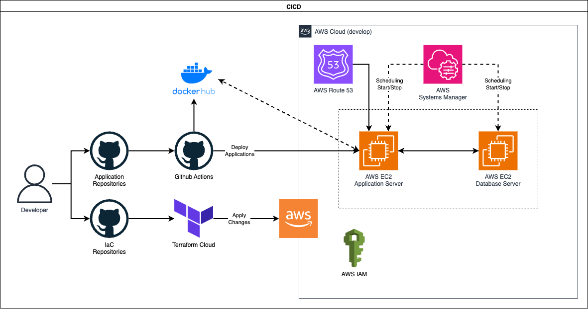

# Terraform으로 관리하는 클라우드 인프라 (AWS & Cloudflare)

개인 프로젝트에 필요한 클라우드 인프라를 Terraform을 사용하여 코드형 인프라(Infrastructure as Code, IaC)로 관리하는 리포지토리입니다. AWS와 Cloudflare 리소스를 코드로 정의하고, Terraform Cloud를 통해 배포를 자동화하여 일관성 있고 반복 가능한 인프라 환경 구축을 목표로 합니다.

## 주요 특징

- **Infrastructure as Code**: Terraform을 사용하여 모든 인프라를 코드로 명확하게 정의하고 버전 관리합니다.
- **Multi-Provider**: AWS의 핵심 서비스와 Cloudflare의 DNS, 스토리지 기능을 통합 관리합니다.
- **모듈식 설계**: 서비스별 모듈화를 통해 코드의 재사용성과 유지보수성을 극대화했습니다.
- **CI/CD 자동화**: Terraform Cloud의 VCS 연동을 통해 코드 변경 시 자동으로 Plan/Apply가 실행됩니다.
- **형상 관리**: 변수 파일을 기능(`users`, `policies` 등)에 따라 분리하여 관리의 편의성을 높였습니다.

## 프로젝트 구조

```
/
├── main.tf                         # Terraform 실행의 시작점, 전체 모듈 구성
├── variable.tf                     # 루트 모듈에서 사용하는 변수 선언
├── *.auto.tfvars                   # 사용자, 정책 등 변수 값 자동 주입
│
├── aws/                            # AWS 관련 리소스 모음
│   ├── aws.tf                      # 모듈 호출 정의
│   ├── ec2/                        # EC2 인스턴스, 보안 그룹
│   ├── elastic_ip/                 # EC2 고정 IP
│   ├── key_pair/                   # SSH 키페어
│   ├── lightsail/                  # Lightsail 인스턴스 (DB 서버)
│   ├── iam/                        # IAM 사용자, 그룹, 정책, 역할
│   ├── ssm/                        # Systems Manager (EC2 자동 시작/중지)
│   └── billing/                    # 예산 및 결제 알림
│
├── cloudflare/                     # Cloudflare 관련 리소스 모음
│   ├── cloudflare.tf               # DNS 레코드, R2 커스텀 도메인 정의
│   ├── r2/                         # R2 오브젝트 스토리지
│   └── d1/                         # D1 서버리스 데이터베이스
│
├── scripts/                        # EC2/Lightsail User Data 셸 스크립트
└── README.md
```

## 관리 대상 리소스

- **AWS**
  - **컴퓨팅**: EC2 인스턴스 (애플리케이션 서버), Lightsail 인스턴스 (DB 서버)
  - **네트워킹**: 보안 그룹, Elastic IP, Lightsail Static IP
  - **보안 및 자격 증명**: IAM 사용자, 그룹, 역할, 정책, Key Pair
  - **운영 관리**: SSM Maintenance Window (EC2 오전 8시 시작 / 오후 10시 중지)
  - **비용 관리**: AWS 예산 알림 (85% / 100% / 100% 예보, $20 한도)
- **Cloudflare**
  - **DNS**: `www`, `ssh`, `db`, `payment`, `cdn` 서브도메인 레코드
  - **R2**: `content` 오브젝트 스토리지 버킷 (`cdn.dev-monty.me` 커스텀 도메인 연결)

## CI/CD 파이프라인



이 프로젝트는 **Terraform Cloud**의 VCS 연동을 통해 CI/CD 파이프라인을 구성합니다.

- **Trigger**: GitHub 레포지토리에 코드가 push되면 Terraform Cloud에서 자동으로 워크플로우가 실행됩니다.
- **Flow**:
  1. **Plan**: 변경 사항을 분석하여 인프라에 적용될 내용을 미리 확인합니다.
  2. **Apply**: Plan 검토 후 승인 시 실제 인프라에 변경 사항을 적용합니다.

State 파일은 Terraform Cloud에서 중앙 관리됩니다.

## 개발 가이드

로컬 실행 방법 및 브랜치 전략은 [CONTRIBUTING.md](CONTRIBUTING.md)를 참고해주세요.
