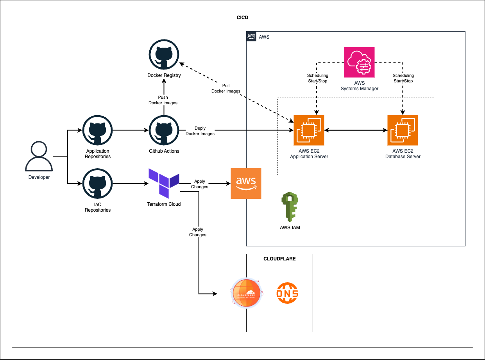

# backend-iac-terraform
개인 프로젝트에 쓰이는 클라우드 환경을 코드로 관리(Infrastructure as Code, IaC)하는 리포지토리입니다.

Terraform을 사용하여 인프라의 생성, 변경, 버전 관리를 자동화하여 수동 작업으로 인한 실수를 줄이고, 반복 가능하며 일관된 인프라 환경을 구축하는 것을 목표로 합니다.

## 1. 프로젝트 구조

프로젝트는 기능별, 서비스별 모듈화를 통해 체계적으로 구성되어 있습니다.

```
/
├── main.tf                     # Terraform 실행의 시작점, 전체 모듈 구성
├── variable.tf                 # 루트 모듈에서 사용하는 변수 선언
├── *.auto.tfvars               # 사용자, 정책 등 환경별 변수 값 자동 주입
├── aws/                        # AWS 관련 리소스 모음
│   ├── ec2/                    # EC2, 보안 그룹 등
│   ├── iam/                    # IAM 사용자, 그룹, 정책, 역할
│   ├── ssm/                    # Systems Manager (문서, 유지보수 창)
│   ├── billing/                # 비용 및 예산 관리
│   └── ...
├── docker/                     # Docker 관련 리소스 (필요시 확장)
├── scripts/                    # EC2 User Data 등 셸 스크립트
└── ...
```

- **`main.tf`**: 전체 인프라의 구성을 정의하고 각 모듈을 호출하는 메인 파일입니다.
- **`aws/`**: AWS 리소스를 서비스 단위(EC2, IAM 등)로 모듈화하여 관리합니다. 이를 통해 코드의 재사용성과 유지보수성을 높입니다.
- **`variables-*.auto.tfvars`**: `users`, `policies` 등 목적에 따라 변수 파일을 분리하여 관리의 편의성을 더했습니다. Terraform은 실행 시 `.auto.tfvars`로 끝나는 파일을 자동으로 로드합니다.
- **`scripts/`**: `ec2_userdata.sh`와 같이 EC2 인스턴스 초기 설정에 사용되는 스크립트를 보관합니다.

## 2. 관리 대상 리소스

본 Terraform 프로젝트를 통해 다음의 AWS 리소스를 관리합니다.

- **컴퓨팅**: EC2 인스턴스, EC2 Key Pair
- **네트워킹**: 보안 그룹 (Security Group)
- **보안 및 자격 증명**: IAM 사용자, 그룹, 역할, 정책
- **비용 관리**: AWS 예산 (Budget) 및 결제 알림
- **운영 관리**: SSM 문서, 유지보수 창, 대상 및 작업

## 3. CICD 구성


---
## 4. 시작하기
1. 각 환경별로 pull_request 및 push 를 통해 관리하고, Terraform Cloud 를 통해 관리하도록 한다.  
   - Terraform Cloud URL: https://app.terraform.io/app/organizations
2. `Admin`그룹은 콘솔상에서 직접 관리한다.

---
## 5. Git Flow

- [Terraform](https://www.terraform.io/downloads.html) (1.0.0 이상 권장)
- [AWS CLI](https://aws.amazon.com/cli/)
- AWS 계정 및 Access Key/Secret Key 설정 완료 (`aws configure`)

### Local 개발 환경 구성

> **주의!**
> 이 프로젝트는 Terraform Cloud 워크플로우를 통해 변경 사항을 적용하는 것을 원칙으로 합니다. Local 환경에서의 `apply`는 테스트 목적 또는 긴급 상황에서만 사용해야 합니다.

1.  **Terraform 초기화**
    Terraform이 필요한 플러그인(Provider)을 다운로드하고 초기 설정을 진행합니다.
    ```bash
    terraform init
    ```

2.  **Terraform 유효성 검사**
    Terraform 코드의 문법이 유효한지 검사합니다.
    ```bash
    terraform validate
    ```

3.  **실행 계획 검토 (Dry-Run)**
    인프라에 적용될 변경 사항을 미리 확인합니다.
    ```bash
    terraform plan
    ```

4.  **인프라 적용**
    계획된 변경 사항을 실제 인프라에 적용합니다.
    - AWS 프로필이 `default`로 설정된 경우:
      ```bash
      terraform apply
      ```
    - 특정 AWS 프로필을 지정할 경우:
      ```bash
      AWS_PROFILE=your_profile_name terraform apply
      ```

5.  **인프라 삭제**
    Terraform으로 생성한 모든 리소스를 삭제합니다. **(주의: 모든 인프라가 사라지므로 신중하게 사용해야 합니다)**
    ```bash
    terraform destroy
    ```

---
## 6. Git Flow 
```
origin
    ㄴ master
    ㄴ develop
    ㄴ features
        ㄴ branch1...
        ㄴ branch2...
```
```
1. 각 브랜치들은 backend-api-server 리포지토리의 브랜치와 동일하게 환경 구성을 한다.

2. 개발 완료 루 develop 으로 Pull Request 생성, Merge 한다.
```
backend-api-server URL: https://github.com/Monty-Oh/backend-api-server
